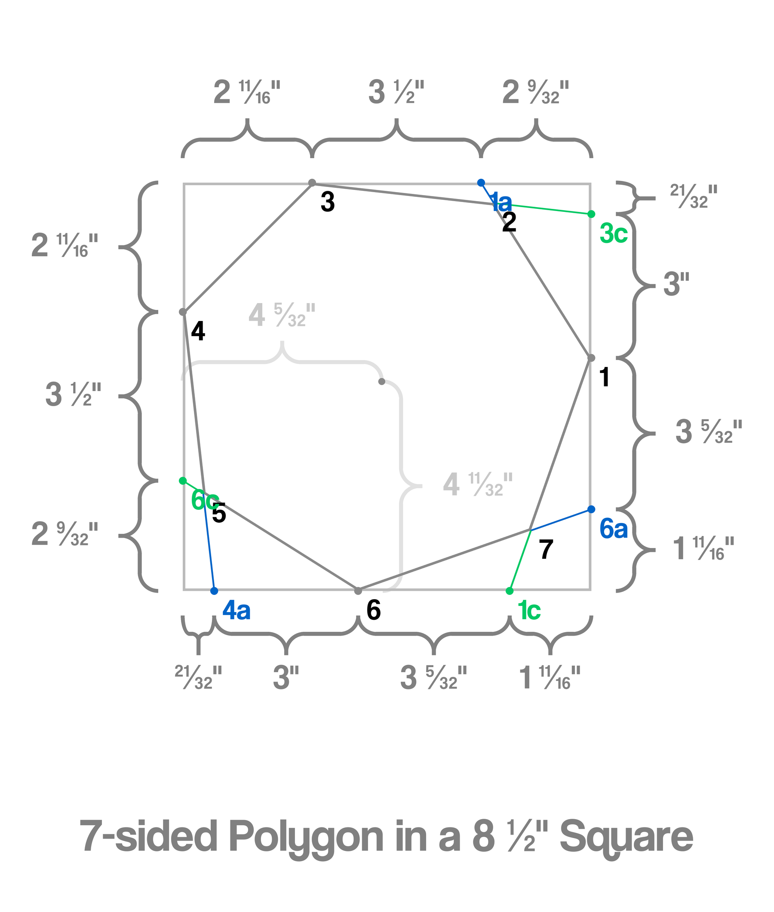
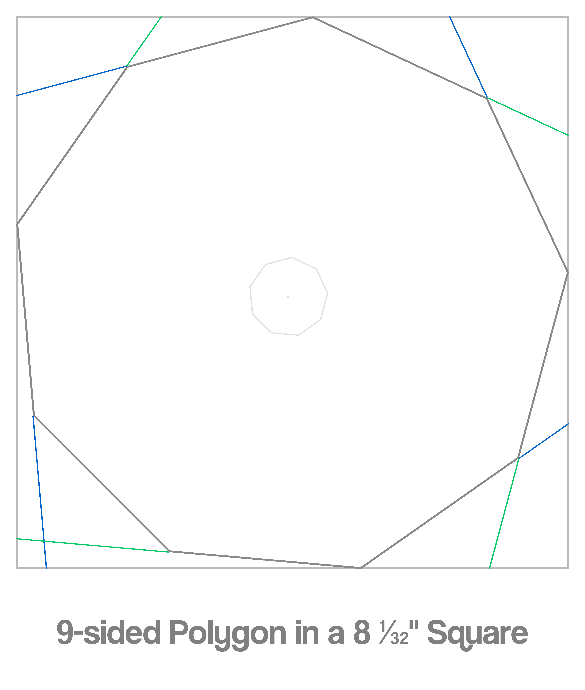

# MaxPolygon

This script generates a diagram of the largest possible regular polygon that can fit inside a square sheet of paper. 



The diagram has side measurements that help you cut out a perfect, symmetrical shape that maximizes the use of the available surface area.


You can also tell the script to render a PDF that can be printed out and directly cut out.
<em>a</em> stands for anticlockwise and <em>c</em> stands for clockwise.

<br>

## Dependencies
You will need PIL, numpy and reportlab to run this script.
```pip install pillow numpy reportlab```

<br>

### Configuration
You can change constants under maxpolygon._config.py in order to modify the appearance.
