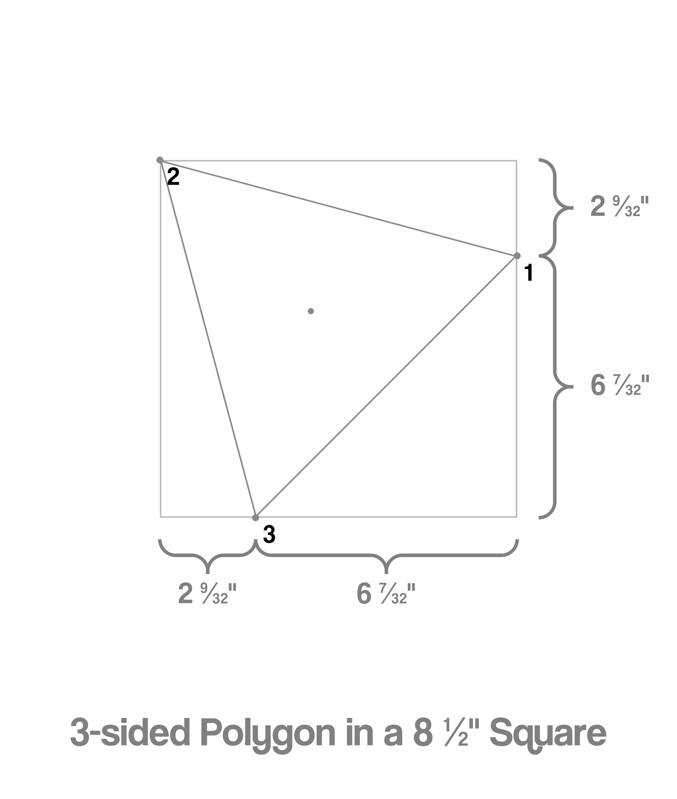

# MaxPolygon

This script generates a diagram of the largest possible regular polygon that can fit inside a square sheet of paper. 


The diagram has side measurements that help you cut out a perfect, symmetrical shape that maximizes the use of the available surface area.

<br>

## Dependencies
You will need PIL and numpy to run this script.
```pip install pillow numpy```

<br>

# Results

<em>a</em> stands for anticlockwise and <em>c</em> stands for clockwise.

### Configuration
You can change constants under maxpolygon._config.py in order to modify the appearance.
