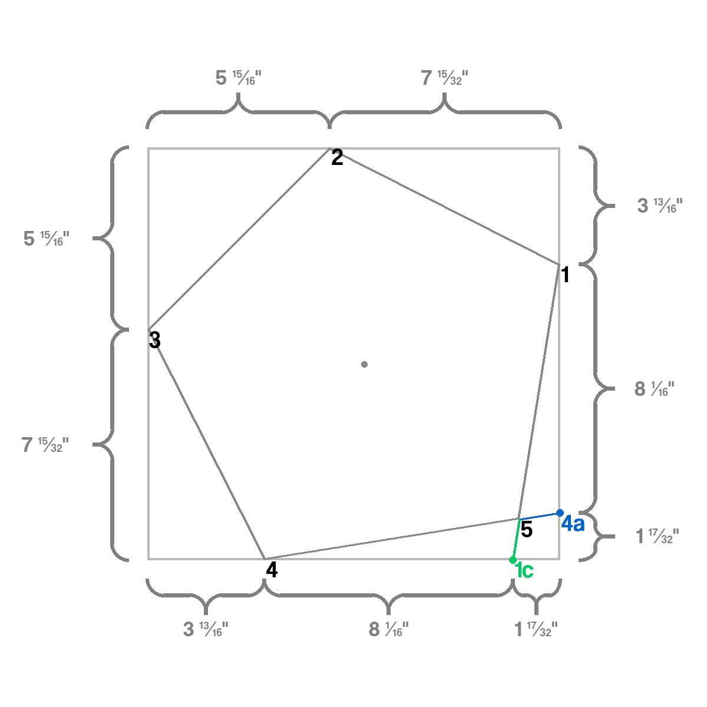
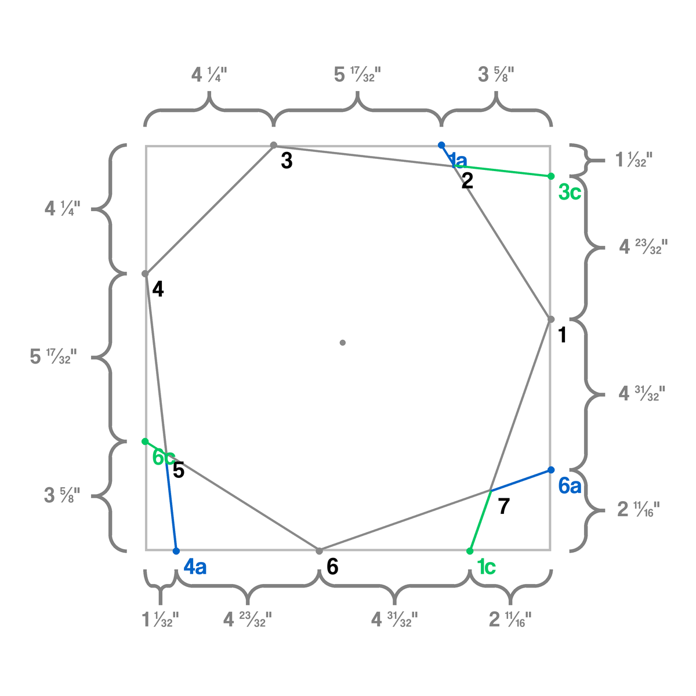
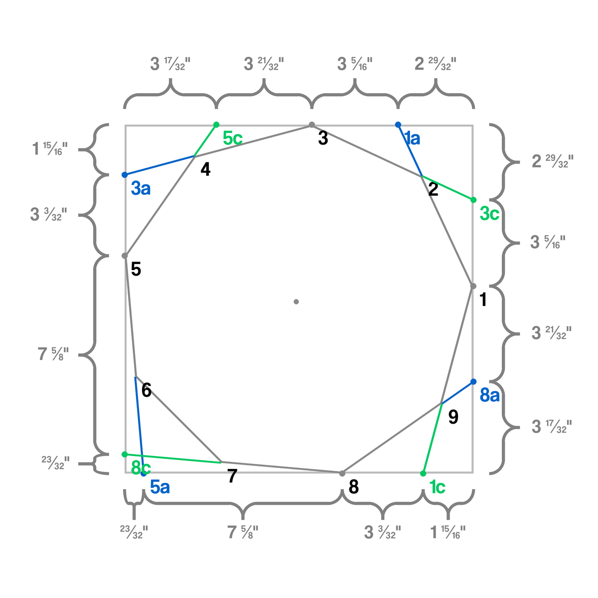

# MaxPolygon
This script determines the points of the largest possible perfect polygon on a square sheet of paper, then draws and saves a diagram.
The measurements are relative to the closest edge of the paper.

